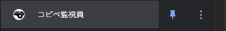
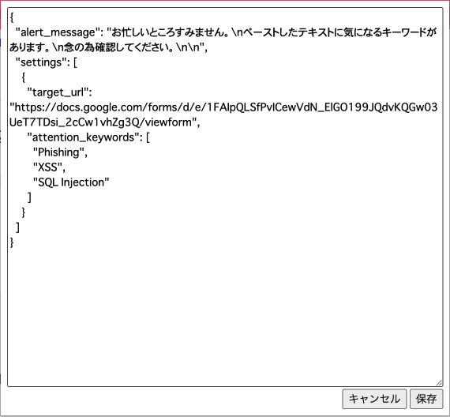
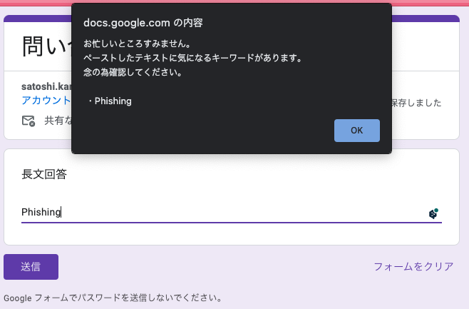

# コピペ監視員（Copy and Paste Observer）

「コピペ監視員（Copy and Paste Observer）」は、コピペ操作を制御し、危険なコピペが発生したら注意をする Chrome 拡張機能です。  
manifest_version 3 を使用しています。

## インストール方法

「開発環境でのローカルテスト方法」をご覧ください。

## 使い方

ブラウザの拡張機能で「コピペ監視員」をクリックします。  

設定画面で、監視対象の URL とキーワードを設定します。

設定は JSON 形式です。  
target_url は監視対象の URL です。  
アクティブタブの URL がここに指定された文字列と部分一致する時、ペースト時に内容のチェックを行います。  
attention_keywords はチェック対象の文字列です。  
ペースの内容にここに指定したキーワードのいずれかが含まれていると、  
ペースト後に警告メッセージを表示します。

### 注意事項

- 設定変更後は、ページをリロードしないと反応しないことがあります。
- iframe 内の入力欄には反応しません。

## 開発者向け情報

### 開発環境でのローカルテスト方法

1. Google Chrome の設定画面を開きます。
2. [設定] > [拡張機能]を選択します。
3. ページ上部の「デベロッパーモード」をオンにします。
4. 「パッケージ化されていない拡張機能を読み込む」ボタンをクリックし、このソースのルートディレクトリを選択します。
5. 拡張機能がロードされ、拡張機能リストに表示されます。  
   ここで拡張機能の動作をテストできます。

#### 注意

拡張機能の開発やテスト、配布は Chrome のデベロッパーモードが必要です。  
デベロッパーモードは、通常のブラウジングには影響を与えませんが、セキュリティ上のリスクがあるため、使用後は必ずオフにすることを推奨します。

### background.js のログ

background.js にログ出力をしても画面のコンソールには出力されません。  
「Service Worker」の方に出力されます。

1. Google Chrome の設定画面を開きます。
2. [設定] > [拡張機能]を選択します。
3. [コピペ監視員]の[詳細]を選択します。
4. [Service Worker]を選択します。
5. Console にログが出力されるので、ここで確認します。

### 配布用モジュールの作成方法

1. 開発が完了したら、拡張機能のルートディレクトリで全てのファイルとフォルダを ZIP 形式で圧縮します。  
   この ZIP ファイルが配布用モジュールとなります。
